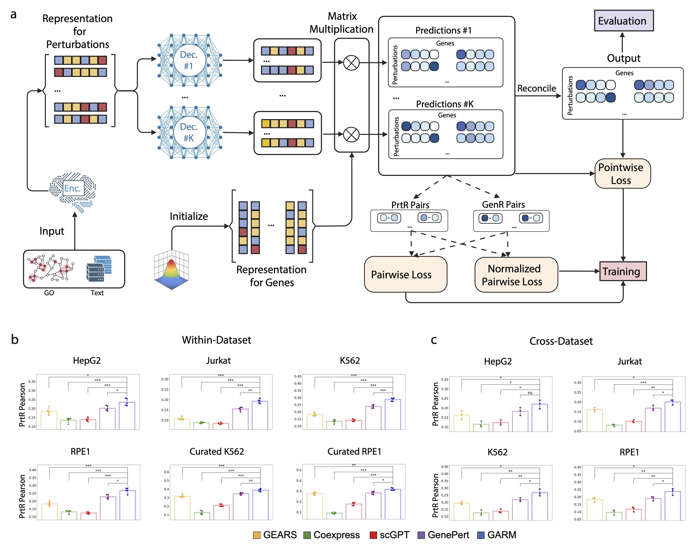
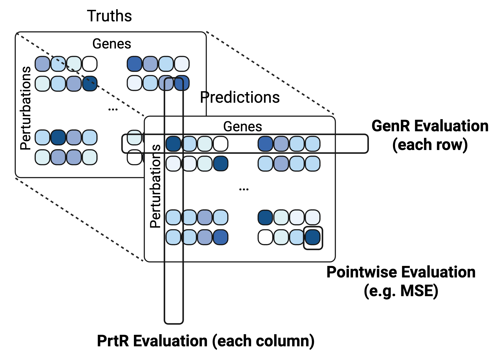

# GARM
Official implementation for GARM method from the paper: **Gradient-aware modeling advances AI-driven prediction of genetic perturbation effects**.

<p align="center">
  
</p>

## Quick Start:
**[Required]** Clone the github to your developement space.
```bash
git clone https://github.com/DixianZhu/GARM.git
```
**[Optional]** Install the anaconda environment for dependencies of the code (with your conda on). Then, activate the working environment. This step can be skipped if you already have an environment with necessary packages such as torch, torch_geometric, scanpy, etc. 
```bash
conda env create -f environment.yml
conda activate GARM
```
The yml file only works in Linux platform. For the other platforms, please try the following step or install the required packages manually.
```bash
conda env -n GARM python=3.9.23
conda activate GARM
pip3 install -r requirements.txt 
```
The total installation time should be less than half hour, which can vary a little. 
**[Required]** Download the ancillary files, such as, GO (Gene Ontology), scGPT, GenePT based gene-feature, the cross-dataset in pseudo-bulk level, gene signature files, etc. from [figshare](https://doi.org/10.6084/m9.figshare.29947694.v3). Unzip data.zip under the GARM code folder.

**[Optional]** For within-dataset experiment, if you want to run on the original HepG2, Jurkat, K562 and RPE1 datasets, please download the '*_raw_singlecell_01.h5ad' files from their original paper ([GSE264667](https://www.ncbi.nlm.nih.gov/geo/query/acc.cgi?acc=GSE264667) and [figshare](https://doi.org/10.25452/figshare.plus.20029387.v1)) to the data folder (under 'GARM/data/xxx_essential_sc/' and renamed as 'xxx_essential_raw_singlecell.h5ad', where 'xxx' is a string in ['hepg2', 'jurkat', 'k562', 'rpe1']).

## Usage (Demo):
Run GARM on within-dataset Prediction on Unseen Single-Gene Perturbation Transcriptional Responses (on 'Curated K562' dataset).
```python
python3 main_GARM.py --dataset=curated_k562 --lr=1e-3 --decay=1e-8 --K=1024 --layers=2 --batch_size=16 
```
It runs GARM on 5 different data splits with random seeds in [1,2,3,4,5] and 300 epochs on each split, which can take up to several hours to finish. 

Run GARM on Cross-Dataset Prediction on Single-Gene Perturbation Transcriptional Responses, where the Essential-Wide datasets ['jurkat', 'hepg2', 'k562', 'rpe1'] are taken from Nadig et al. and Replogle et al.
```python
python3 main_GARM_cross.py --lr=1e-3 --decay=1e-6 --K=1024 --layers=2 --batch_size=16 
```

Please explore linear.py, linear_cross.py, main_GEARS.py, main_GEARS_cross.py, main_GAR.py for running other compared methods.

The analysis code for overall performance comparison with automatic hyper-parameter selection on validation performance can be found in [analyze_output.ipynb](https://github.com/DixianZhu/GARM/blob/master/analyze_output.ipynb).

The synthetic experiments can be found in [synthetic.ipynb](https://github.com/DixianZhu/GARM/blob/master/synthetic.ipynb).

## Evaluation:
The current code output pointwise, GenR and PrtR evaluations. GARM performs significantly better on **PrtR**, which is more difficult and closely related to experimental design.

<p align="center">
  
</p>

## Citation:
If you find GARM useful in your work, please cite the following [placeholder](https://arxiv.org/abs/2402.06104):
```
@misc{Placeholder,
      title={Placeholder}, 
      author={Dixian Zhu and Livnat Jerby},
      year={2025},
}
```

## Contact:
For any inquiries on this repository please feel free to post these under "issues" or reach out to Dixian Zhu (dixian-zhu@stanford.edu) and Livnat Jerby (ljerby@stanford.edu).
